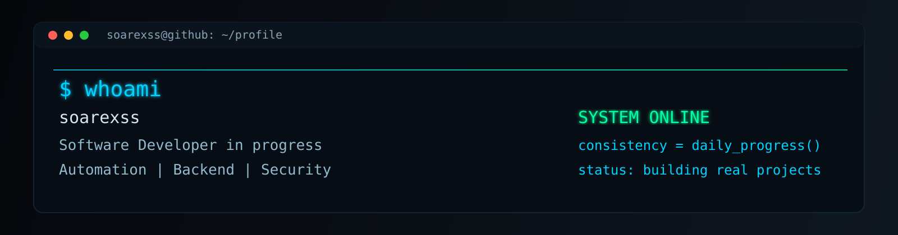



  

  

  
  

<table width="100%">
  <tr>
    <td width="58%" valign="top">
      <h3><code>root@github:~$ ./profile --scan</code></h3>
<pre>
&gt; user      : soarexss
&gt; alias     : soarexss
&gt; role      : Software Developer in progress
&gt; focus     : Automation | Backend | Security
&gt; status    : SYSTEM ONLINE
&gt; mindset   : Practical projects, consistency and clean logic

root@github:~$ █
</pre>
    </td>
    <td width="42%" valign="top">
      <h3><code>about.me</code></h3>
<pre>
Developer in progress focused on
automation, backend systems and
practical software foundations.

current_mode : learn -&gt; build -&gt; refine
mission      : turn ideas into useful tools
approach     : clarity, logic, consistency
</pre>
    </td>
  </tr>
</table>

## Tech Stack

<table>
  <tr>
    <td align="center" width="96"> JavaScript</td>
    <td align="center" width="96"> Python</td>
    <td align="center" width="96"> Java</td>
    <td align="center" width="96"> HTML</td>
    <td align="center" width="96"> CSS</td>
    <td align="center" width="96"> Git</td>
    <td align="center" width="96"> GitHub</td>
    <td align="center" width="96"> VS Code</td>
  </tr>
</table>

## GitHub Metrics

  
  

  

## Extra Pins

### Engineered Solutions

<table>
  <tr>
    <td width="50%" valign="top">
      <h3><a href="https://github.com/soarexss/barberpro">barberpro</a></h3>
      

        
        
      

      <blockquote>Gerenciamento de pequenas barbearias com foco em atendimento ao cliente.</blockquote>
    </td>
    <td width="50%" valign="top">
      <h3><a href="https://github.com/soarexss/barberfacilites">barberfacilites</a></h3>
      

        
        
      

      <blockquote>Projeto academico em desenvolvimento para gestao e apoio operacional.</blockquote>
    </td>
  </tr>
  <tr>
    <td width="50%" valign="top">
      <h3><a href="https://github.com/soarexss/listagem-de-produtos">listagem-de-produtos</a></h3>
      

        
        
      

      <blockquote>Sistema que lista produtos e valores para consultas organizadas.</blockquote>
    </td>
    <td width="50%" valign="top">
      <h3><a href="https://github.com/soarexss/Mini-site-Bootstrap">Mini-site-Bootstrap</a></h3>
      

        
        
      

      <blockquote>Site de treino para praticar componentes e estrutura Bootstrap.</blockquote>
    </td>
  </tr>
</table>

---

<i>"Disciplina e consistencia transformam estudo em resultado."</i>

  

  

